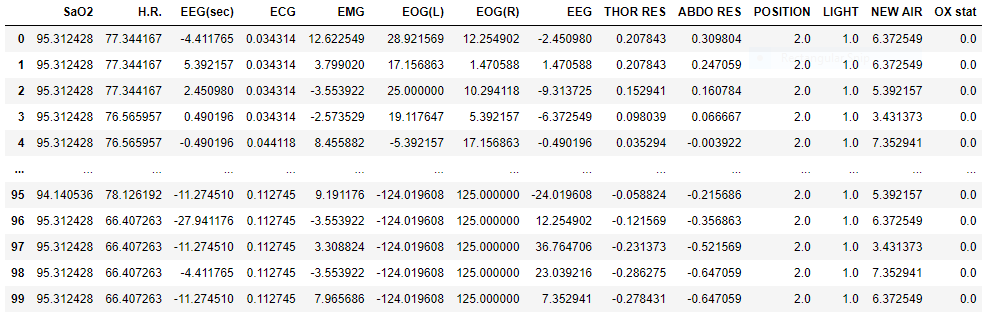

## Introduction

The project code can be found [here](https://github.com/chinkevin/DSC180_sleep_apnea).

In this project, we aim to explore sleep stage classification for individuals specifically with [sleep apnea](https://www.mayoclinic.org/diseases-conditions/sleep-apnea/symptoms-causes/syc-20377631). Current sleep stage scoring is done by hand which is somewhat subjective so human scorers don’t agree a lot of the time. Moreover, current automated sleep stage scoring models don't generalize well to patients with sleep apnea. 

This work is important because sleep apnea can cause serious health issues for patients. It increases the risk of stroke, breathing problems, obesity, heart failure, and even sudden death. So the analysis of sleep data is essential for understanding and diagnosing sleep-related diseases in order to prevent life-changing health problems.

Our goal is to further explore the relationship between sleep stages and sleep apnea by building a sleep stage classifier that specifically includes ECG signals. We suspect that including ECG signals will improve the current models’ performance because it can identify obstructive sleep events, such as waking during sleep cycle, which individuals with sleep apnea often encounter.

## Our Data

The data we have chosen to work with comes from the National Sleep Research Resource (NSRR). Specifically, we used the Sleep Heart Health Study (SHHS) which consists of two visits and the respective overnight [polysomnography](https://www.mayoclinic.org/tests-procedures/polysomnography/about/pac-20394877#:~:text=Polysomnography%2C%20also%20called%20a%20sleep,leg%20movements%20during%20the%20study) recordings. Since the second visit has less participants and was done more recently, to make sure we had a more reliable and complete dataset we continued with the second visit (SHHS 2). This visit consists of 2,651 subjects and their respective 9 hour recordings of EEG, EOG, EMG, and ECG signals in 30 second periods. 

To learn more about the full dataset, check out this [link](https://sleepdata.org/datasets/shhs/pages/04-dataset-introduction.md).

Here is a snippet of a single participant’s signal recordings:

## Our Methods
### Feature Extract EEG, EMG, EOG and Demographics
In order to extract features from EEG, EMG, EOG signals and demographics, we followed the preprocessing and feature extraction process found in the [Yasa Classifier](https://github.com/raphaelvallat/yasa_classifier). For a more in-depth explanation about the Yasa Classifier, [here](https://elifesciences.org/articles/70092) is a great article that thoroughly explains the software along with the testing, data, performance, advantages, limitations, and scientific methods.

### Feature Extract ECG
In order to extract features from ECG signals, we followed the preprocessing and feature extraction process found in [SleepECG](https://github.com/cbrnr/sleepecg). For a more in-depth explanation about SleepECG, check out this [page](sleep_ecg.md).

### LGBM Classifier

## Models and Performance

## Results and Conclusion

## Reference

1. https://www.mayoclinic.org/diseases-conditions/sleep-apnea/symptoms-causes/syc-20377631
2. https://www.mayoclinic.org/tests-procedures/polysomnography/about/pac-20394877#:~:text=Polysomnography%2C%20also%20called%20a%20sleep,leg%20movements%20during%20the%20study
3. https://sleepdata.org/datasets/shhs/pages/04-dataset-introduction.md
4. https://github.com/raphaelvallat/yasa_classifier
5. https://elifesciences.org/articles/70092
6. https://github.com/cbrnr/sleepecg

Vallat, Raphael, and Matthew P. Walker. “A Universal, Open-Source, High-Performance Tool for Automated Sleep Staging.” BioRxiv, Cold Spring Harbor Laboratory, 1 Jan. 2021, https://www.biorxiv.org/content/10.1101/2021.05.28.446165v1.full.
