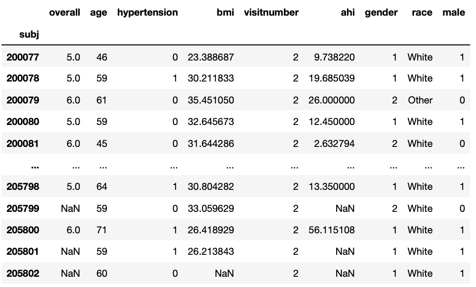
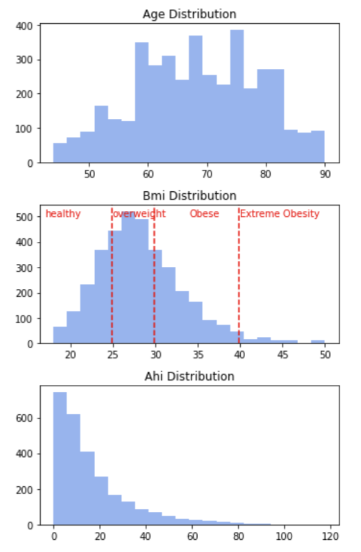

### Introduction

The project code can be found [here](https://github.com/chinkevin/DSC180_sleep_apnea).

In this project, we aim to explore sleep stage classification for individuals specifically with [sleep apnea](https://www.mayoclinic.org/diseases-conditions/sleep-apnea/symptoms-causes/syc-20377631). Current sleep stage scoring is done by hand which is somewhat subjective so human scorers don’t agree a lot of the time. Moreover, current automated sleep stage scoring models don't generalize well to patients with sleep apnea. 

This work is important because sleep apnea can cause serious health issues for patients. It increases the risk of stroke, breathing problems, obesity, heart failure, and even sudden death. So the analysis of sleep data is essential for understanding and diagnosing sleep-related diseases in order to prevent life-changing health problems.

Our goal is to further explore the relationship between sleep stages and sleep apnea by building a sleep stage classifier that specifically includes ECG signals. We suspect that including ECG signals will improve the current models’ performance because it can identify obstructive sleep events, such as waking during sleep cycle, which individuals with sleep apnea often encounter.

### Data

Because the SHHS consists of two visits, and the number of participants in the second visit is clearly smaller than that in the first visit, to make sure we have a complete record of both visit polysomnography data, we decided to start EDA on the second visit participants. 

All participants data in visit 2 are saved in this dataframe:

To accord with the epoch period in our later model planning, EEG, ECG, and EOG data are analyzed and visualized in 30-sec periods (One period EDA is shown in the Result section). We also plot an overnight spectrogram of EEG, which demonstrates the relationship between time and Frequency.

### Exploratory Data Analysis

### Feature Extraction

### Models and Performance

### Result

### Reference

Vallat, Raphael, and Matthew P. Walker. “A Universal, Open-Source, High-Performance Tool for Automated Sleep Staging.” BioRxiv, Cold Spring Harbor Laboratory, 1 Jan. 2021, https://www.biorxiv.org/content/10.1101/2021.05.28.446165v1.full.

https://www.mayoclinic.org/diseases-conditions/sleep-apnea/symptoms-causes/syc-20377631

### Jekyll Themes

Your Pages site will use the layout and styles from the Jekyll theme you have selected in your [repository settings](https://github.com/YilanG08/YilanG08.github.io/settings/pages). The name of this theme is saved in the Jekyll `_config.yml` configuration file.

### Support or Contact

Having trouble with Pages? Check out our [documentation](https://docs.github.com/categories/github-pages-basics/) or [contact support](https://support.github.com/contact) and we’ll help you sort it out.
