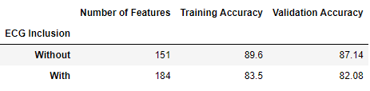
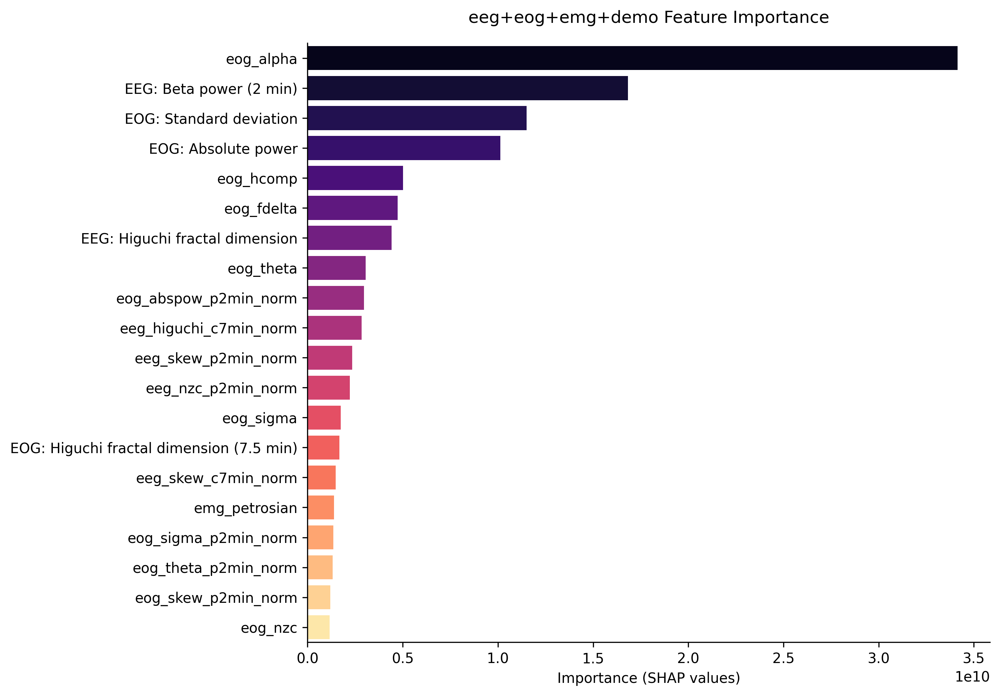
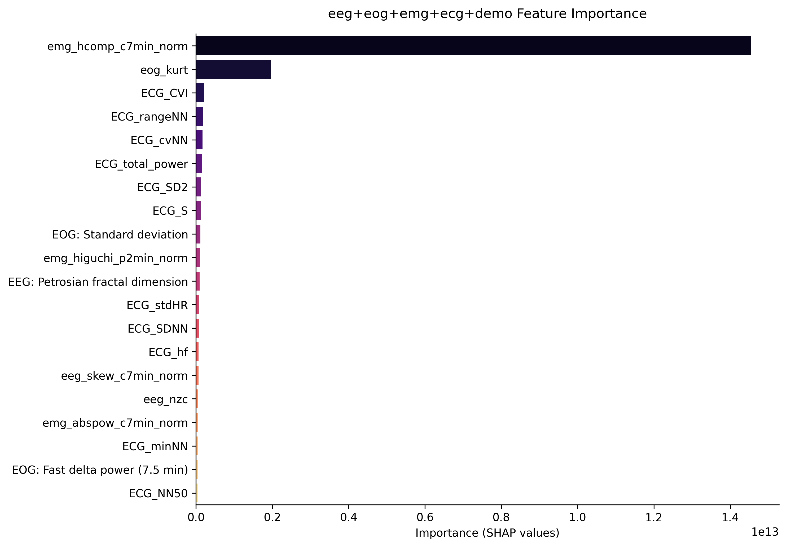

## Introduction

The project code can be found [here](https://github.com/chinkevin/DSC180_sleep_apnea).

In this project, we aim to explore sleep stage classification for individuals specifically with [sleep apnea](https://www.mayoclinic.org/diseases-conditions/sleep-apnea/symptoms-causes/syc-20377631). Current sleep stage scoring is done by hand which is somewhat subjective so human scorers don’t agree a lot of the time. Moreover, current automated sleep stage scoring models don't generalize well to patients with sleep apnea. 

This work is important because sleep apnea can cause serious health issues for patients. It increases the risk of stroke, breathing problems, obesity, heart failure, and even sudden death. So the analysis of sleep data is essential for understanding and diagnosing sleep-related diseases in order to prevent life-changing health problems.

Our goal is to further explore the relationship between sleep stages and sleep apnea by building a sleep stage classifier that specifically includes ECG signals. We suspect that including ECG signals will improve the current models’ performance because it can identify obstructive sleep events, such as waking during sleep cycle, which individuals with sleep apnea often encounter.

## Our Data

The data we have chosen to work with comes from the National Sleep Research Resource (NSRR). Specifically, we used the Sleep Heart Health Study (SHHS) which consists of two visits and the respective overnight [polysomnography](https://www.mayoclinic.org/tests-procedures/polysomnography/about/pac-20394877#:~:text=Polysomnography%2C%20also%20called%20a%20sleep,leg%20movements%20during%20the%20study) recordings. Since the second visit has less participants and was done more recently, to make sure we had a more reliable and complete dataset we continued with the second visit (SHHS 2). This visit consists of 2,651 subjects and their respective 9 hour recordings of EEG, EOG, EMG, and ECG signals in 30 second periods. 

To learn more about the full dataset, check out this [link](https://sleepdata.org/datasets/shhs/pages/04-dataset-introduction.md).

Here is a snippet of a single participant’s signal recordings:

## Our Methods
### Feature Extract EEG, EMG, EOG and Demographics
In order to extract features from EEG, EMG, EOG signals and demographics, we followed the preprocessing and feature extraction process found in the [Yasa Github](https://github.com/raphaelvallat/yasa). For a more in-depth explanation about the Yasa Classifier, [here](https://elifesciences.org/articles/70092) is a great article that thoroughly explains the software along with the testing, data, performance, advantages, limitations, and scientific methods.

### Feature Extract ECG
In order to extract features from ECG signals, we followed the preprocessing and feature extraction process found in [SleepECG](https://github.com/cbrnr/sleepecg). For a more in-depth explanation about SleepECG, check out their [Documentation](https://sleepecg.readthedocs.io/en/stable/heartbeat_detection.html) page.

### LightGBM Classifier
We then passed all of our extracted features into a Light Gradient Boosted Machine to classify each epoch as one of the following stages: W (wake), R (REM), N1, N2, N3. To learn more about the LGBM algorithm, see our [LightGBM Explained](lgbm_explained.md) page

## Models and Performance

The following is the results from our two models. The first model extracts features from EEG, EMG, EOG signals and demographics of the patient. The second model uses all of the features from the first model plus extracted features from ECG signals.

  
## Results and Conclusion

To our surprise, the inclusion of features extracted from ECG data did not improve the model's performance. The model with ECG features performed roughly 5-6% worse in training and validation accuracy compared to the original model without ECG features. Furthermore, the first graph shows the feature importance from the first model without ECG signals. It is clear that the most important features come from EOG and EEG signals. The second graph shows the feature importace from the second model which includes ECG signals. Although features extracted from ECG data are in the top 3 most important here, its importance is relatively low compared to the first two features which come from EOG and EMG data. This implies that the inclusion of ECG data did not help the model classify sleep stages for patients with sleep apnea.

Even though our findings did not match our hypothesis, our work was still important for future research within the area of sleep analysis or sleep stage classifying. Our findings may help direct others to exclude ECG signals in their models or dive deeper into the reasoning behind why ECG signals may not work so well. 

## Reference

1. https://www.mayoclinic.org/diseases-conditions/sleep-apnea/symptoms-causes/syc-20377631
2. https://www.mayoclinic.org/tests-procedures/polysomnography/about/pac-20394877#:~:text=Polysomnography%2C%20also%20called%20a%20sleep,leg%20movements%20during%20the%20study
3. https://sleepdata.org/datasets/shhs/pages/04-dataset-introduction.md
4. https://github.com/raphaelvallat/yasa_classifier
5. https://elifesciences.org/articles/70092
6. https://github.com/cbrnr/sleepecg
7. https://sleepecg.readthedocs.io/en/stable/heartbeat_detection.html
